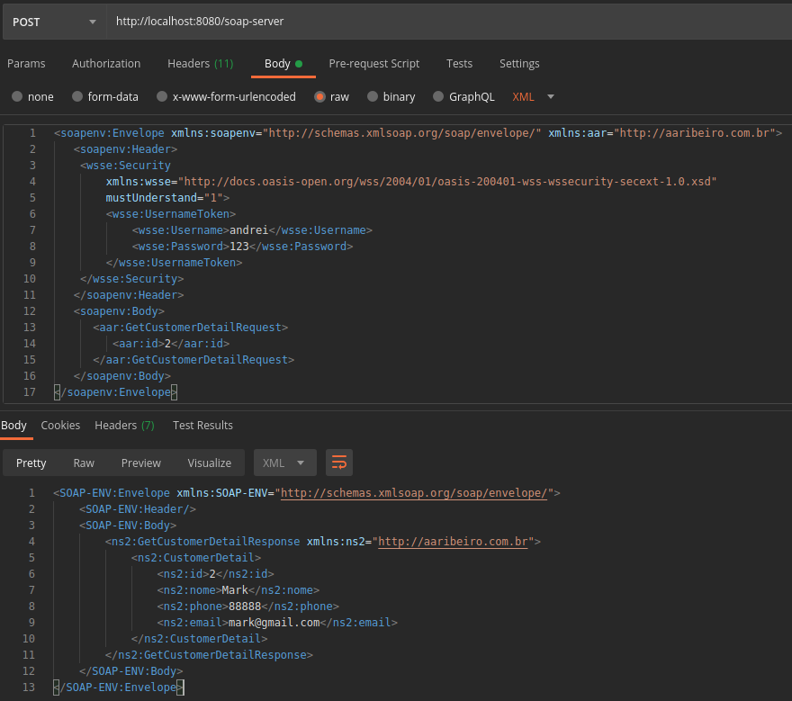
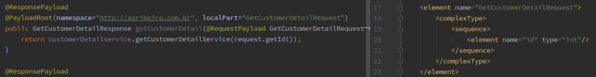
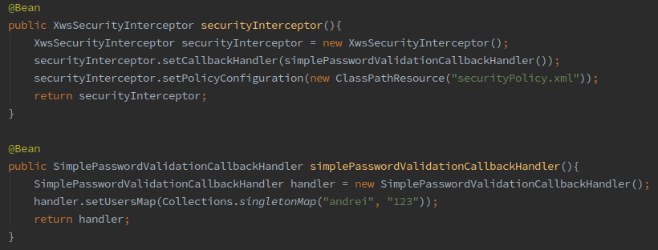
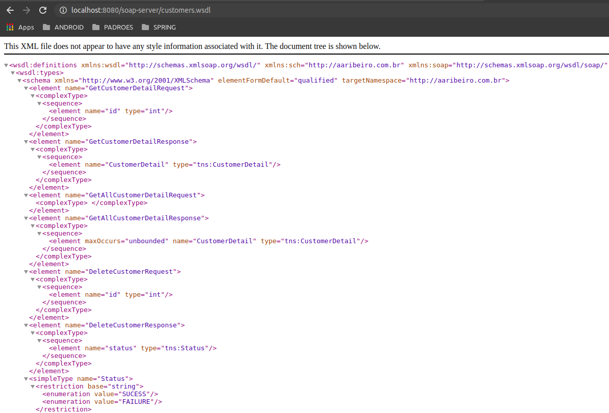

# Soap-Server

Microserviço responsável por consumir e produzir informações via SOAP.

Este projeto simula um web-service que responde a requisições em formato SOAP.

Nesta integração este microserviço converte os dados enviados via SOAP em objetos gerados a partir de um XSD para a aplicação das regras de negócio, 
e posteriormente retorna ao requisitante (https://github.com/andreiRibeiro/INTEGRACOES-SoapClient) as informações solicitadas via objeto SOAP.

## 1. Eh possível via API solicitar os dados de um cliente infomando neste caso o id.

## 2. O sistema realiza o parse dos objetos através dos schemas fornecidos pelo XSD.

## 3. O sistema intercepta em tempo de requisição usuario e senha (securityPolicy) configurados em processo de SimplePasswordValidationCallbackHandler.

## 4. O sistema fornece aos seus clientes link de acesso ao WSDL para construção de seus objetos.

